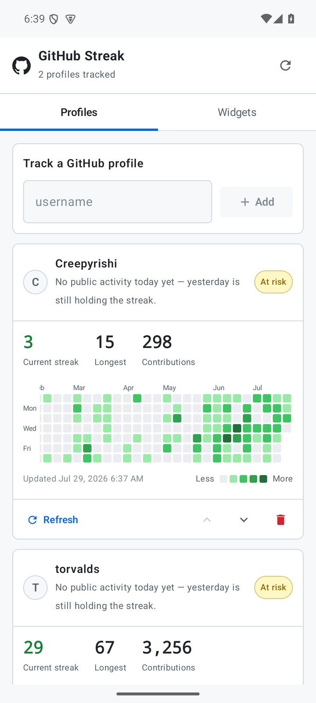
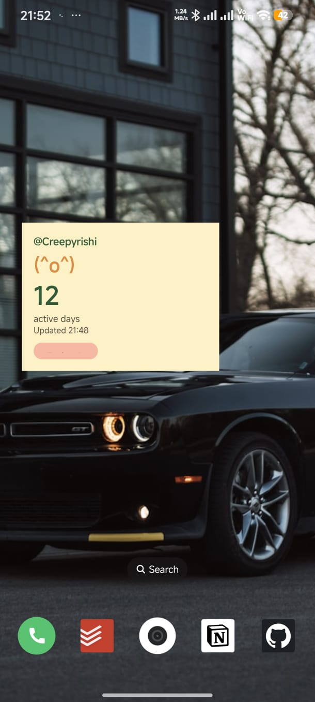

# GitHub Streak Widget

Android app and home-screen widgets for public GitHub activity — streaks and the contribution
calendar — for as many usernames as you like.

The app does not need a GitHub token, login, or backend server. It reads the public GitHub
contribution calendar that anyone can see on a GitHub profile.

This app is vibe coded.

## Download

[Download latest APK](https://github.com/Creepyrishi/GitStreakWidget/releases/latest/download/github-streak-widget.apk)

[View all releases](https://github.com/Creepyrishi/GitStreakWidget/releases)

## Screenshots

<p>
  
  
</p>

## Features

- Track any number of public GitHub usernames side by side.
- Two widgets:
  - **Streak** — current streak, longest streak, contribution total, and the last seven days.
  - **Contribution graph** — the GitHub contribution calendar, sized to the widget.
- Every widget instance binds to its own profile, so you can watch several accounts at once —
  including two widgets of the same kind for two different people.
- Manage profiles and every placed widget from inside the app.
- Per-widget light / dark / follow-system appearance.
- GitHub Primer colour palette throughout, in both light and dark mode.
- No GitHub token and no account login.
- Manual refresh from the app or from a widget, plus automatic refresh every 4 hours via
  WorkManager.

## Profiles and Widgets

Profiles live in the **Profiles** tab. Adding a username immediately fetches its calendar.

Widgets live in the **Widgets** tab:

- **Add a widget** asks the launcher to drop one on the home screen.
- **Placed widgets** lists every widget currently on a home screen with the profile and theme it
  uses, and a **Configure** button to change either.

Dropping a widget from the launcher's own widget picker opens the same configuration screen. A
widget added through the in-app **Add** button skips that screen — Android does not run a
configuration activity for pinned widgets — so it starts on the first profile until you configure
it.

Removing a profile leaves any widget bound to it asking to be reconfigured rather than silently
showing someone else's data.

## Streak Rule

A day counts as active when GitHub's public contribution graph shows at least one visible
contribution for that day.

The app ignores the actual contribution count for the streak. It only checks whether the day was
active or inactive.

```text
If today is active:
    count streak ending today
Else if yesterday was active:
    keep counting streak ending yesterday
Else:
    show 0
```

This means the streak resets to `0` when both today and yesterday are inactive.

The per-day counts and the 0–4 colour levels are still read, because the calendar widget and the
in-app graph need them.

## Data Source

The app fetches public contribution data from:

```text
https://github.com/users/{username}/contributions
```

The URL carries no date parameters on purpose. Passing `?to=<date>` makes GitHub answer with that
whole *calendar year*, future days included, which truncates the graph and under-reports the yearly
total. The bare URL returns the trailing 53 weeks ending today, which is what both widgets draw.

Because this is tokenless, it follows GitHub's public contribution graph. GitHub may include
visible commits, pull requests, issues, reviews, and other public contribution types.

## Privacy

- The app stores only the tracked usernames and their cached calendars on the device.
- No GitHub token is requested.
- No password is requested.
- No analytics or tracking backend is used.
- Network requests go directly from the device to GitHub's public contribution pages.

## Limitations

- Private contribution details are not available without a GitHub token.
- The parser depends on GitHub's public contribution page structure. If GitHub changes that page,
  the parser may need an update — `GithubContributionParserTest` runs against markup copied
  verbatim from github.com so that breakage shows up as a test failure.
- The calendar widget draws its grid as a bitmap, because a home-screen widget cannot hold 371
  individual views. A widget set to **Follow system** therefore keeps the colours it was drawn with
  until its next refresh, so switching the system theme can leave it stale for a while. Pin a
  widget to **Light** or **Dark** if that matters.
- Android widgets do not support rich continuous animation efficiently, so nothing animates.

## Build Without Android Studio

This project can be built with command-line tools only.

Required tools:

- JDK 17
- Android SDK command-line tools
- Android platform `35`
- Android build tools `35.0.0`
- Gradle `8.10.2` or compatible

Debug build:

```bash
gradle :app:assembleDebug --no-daemon --max-workers=2
```

Unit tests:

```bash
gradle :app:testDebugUnitTest --no-daemon --max-workers=2
```

The debug APK is generated at:

```text
app/build/outputs/apk/debug/app-debug.apk
```

For GitHub Releases, upload the APK asset as:

```text
github-streak-widget.apk
```

Install on a connected phone:

```bash
adb install -r app/build/outputs/apk/debug/app-debug.apk
```

## Colab Build

You can build this project on Google Colab by uploading the project folder as a zip, then running
this in a notebook cell from the project root:

```bash
apt-get update
apt-get install -y openjdk-17-jdk unzip curl
curl -L -o android-tools.zip https://dl.google.com/android/repository/commandlinetools-linux-11076708_latest.zip
mkdir -p /content/android-sdk/cmdline-tools
unzip -q android-tools.zip -d /content/android-sdk/cmdline-tools
mv /content/android-sdk/cmdline-tools/cmdline-tools /content/android-sdk/cmdline-tools/latest
yes | /content/android-sdk/cmdline-tools/latest/bin/sdkmanager --sdk_root=/content/android-sdk "platform-tools" "platforms;android-35" "build-tools;35.0.0"
curl -L -o gradle.zip https://services.gradle.org/distributions/gradle-8.10.2-bin.zip
unzip -q gradle.zip -d /content/gradle
export JAVA_HOME=/usr/lib/jvm/java-17-openjdk-amd64
export ANDROID_HOME=/content/android-sdk
export ANDROID_SDK_ROOT=/content/android-sdk
/content/gradle/gradle-8.10.2/bin/gradle :app:assembleDebug --no-daemon --max-workers=2
```

Download the generated APK:

```text
app/build/outputs/apk/debug/app-debug.apk
```

## Release Notes

### `2.0`

- Multiple profiles. Add, reorder, refresh, and remove any number of usernames.
- New **Contribution graph** widget showing the GitHub contribution calendar.
- Each widget instance binds to its own profile, so several accounts can sit side by side.
- Widget management screen listing every placed widget with its profile and theme.
- Per-widget light / dark / follow-system appearance.
- Redesigned app and widgets on the GitHub Primer palette, with full dark-mode support.
- Longest streak and yearly contribution totals.
- Fixed the contribution request returning a calendar year instead of the trailing 53 weeks, which
  had been truncating the graph and under-reporting totals.
- Existing `1.0` installs migrate their saved username into the first profile automatically.

### `1.0`

- Initial Android app.
- Home-screen widget.
- Tokenless public GitHub contribution streak.
- 4-hour automatic refresh.
- Manual refresh.

## Tech Stack

- Kotlin
- Jetpack Compose
- Jetpack Glance
- WorkManager
- DataStore Preferences
- OkHttp
- Jsoup
- JUnit 4
